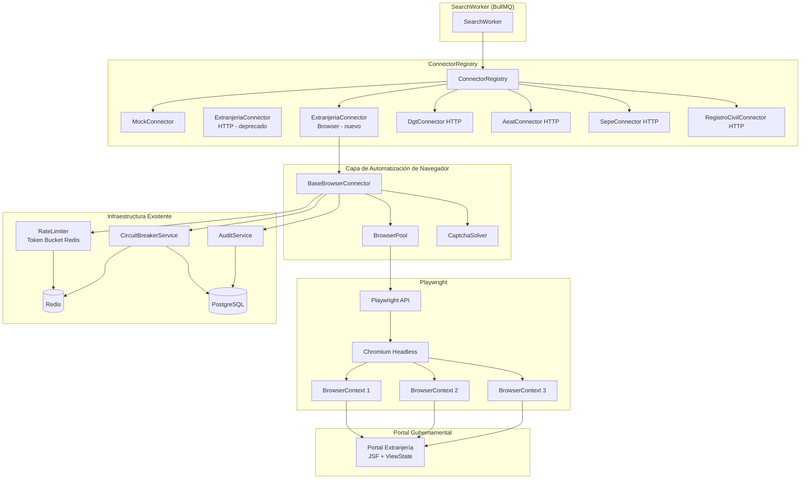
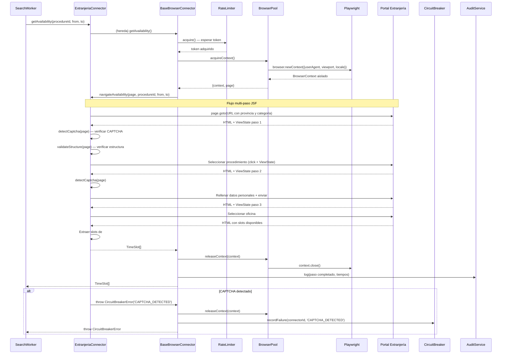
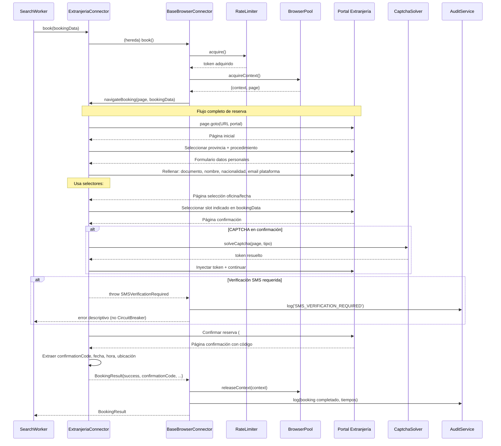

# Diseño — Automatización de Navegador para Conectores de Portales Gubernamentales

## Visión General

Este diseño describe la evolución de la capa de interacción con portales gubernamentales desde HTTP directo (axios) hacia automatización de navegador con Playwright. Los portales gubernamentales españoles (especialmente Extranjería) usan aplicaciones JSF que requieren renderizado JavaScript, gestión de ViewState entre pasos de formulario, y en algunos casos resolución de CAPTCHA. La implementación actual con `BaseRealConnector` y axios no puede interactuar con estos portales porque no ejecuta JavaScript ni mantiene estado de sesión JSF.

La solución introduce tres componentes principales:

1. **`BaseBrowserConnector`**: Clase abstracta que reemplaza a `BaseRealConnector` para conectores que necesitan automatización de navegador. Mantiene la interfaz `IConnector` intacta.
2. **`BrowserPool`**: Pool de instancias de Chromium headless gestionadas por Playwright, optimizado para entornos Docker/Railway con recursos limitados.
3. **`ExtranjeriaConnector` (refactorizado)**: Primera implementación concreta que navega el portal JSF de Extranjería paso a paso.

### Decisiones de diseño clave

- **Playwright sobre Puppeteer**: Playwright ofrece mejor soporte para contextos aislados (`BrowserContext`), auto-wait de selectores, y manejo nativo de múltiples navegadores. Además, su API de `browser.newContext()` permite reutilizar un proceso de navegador para múltiples sesiones aisladas sin compartir cookies ni estado.
- **Pool con contextos aislados**: En lugar de crear/destruir procesos de Chromium por operación, se mantiene un pool de instancias de navegador y se crean `BrowserContext` aislados por operación. Esto reduce el overhead de ~2s por lanzamiento de Chromium a ~50ms por contexto.
- **Imagen Docker `node:20-slim`**: Se migra de `node:20-alpine` a `node:20-slim` (Debian) porque Chromium requiere librerías de sistema (libnss3, libgbm1, etc.) que no están disponibles en Alpine sin compilación manual.
- **Compatibilidad total con SearchWorker**: `BaseBrowserConnector` implementa `IConnector` con la misma firma que `BaseRealConnector`. El `SearchWorker`, `ConnectorRegistry`, `CircuitBreakerService` y `RateLimiter` no requieren cambios.
- **Anti-CAPTCHA como servicio externo opcional**: Si se configura un servicio como 2Captcha, el sistema intenta resolver CAPTCHAs automáticamente. Si no está configurado o falla, se lanza `CircuitBreakerError` para suspender el conector.
- **Verificación SMS como estado intermedio**: Cuando un portal requiere verificación SMS, la reserva se marca con un estado que requiere intervención manual, sin suspender el conector.

## Arquitectura

### Diagrama de componentes



### Flujo de datos: `getAvailability()`



### Flujo de datos: `book()`



## Componentes e Interfaces

### 1. `BrowserPool`

Gestiona instancias de Chromium headless reutilizables con contextos aislados.

```typescript
// src/modules/connectors/browser/browser-pool.ts

export interface BrowserPoolConfig {
  minInstances: number;      // default: 1
  maxInstances: number;      // default: 3 (o BROWSER_POOL_MAX env)
  idleTimeoutMs: number;     // default: 1_800_000 (30 min)
  acquireTimeoutMs: number;  // default: 30_000
  chromiumArgs: string[];    // flags para entorno containerizado
}

export interface BrowserPoolMetrics {
  totalInstances: number;
  activeInstances: number;
  idleInstances: number;
  queuedRequests: number;
}

export interface AcquiredContext {
  context: BrowserContext;
  page: Page;
  release: () => Promise<void>;
}

export class BrowserPool {
  constructor(config?: Partial<BrowserPoolConfig>);

  /** Adquiere un BrowserContext aislado. Espera si no hay instancias disponibles. */
  async acquireContext(): Promise<AcquiredContext>;

  /** Libera un contexto, limpiando cookies y estado. */
  async releaseContext(context: BrowserContext): Promise<void>;

  /** Métricas del pool. */
  getMetrics(): BrowserPoolMetrics;

  /** Cierre ordenado de todas las instancias. */
  async shutdown(): Promise<void>;
}
```

**Detalles de implementación:**
- Cada instancia de Chromium se lanza con: `--no-sandbox`, `--disable-setuid-sandbox`, `--disable-dev-shm-usage`, `--disable-gpu`.
- `acquireContext()` crea un `BrowserContext` nuevo con User-Agent realista, viewport 1280x720, locale `es-ES`.
- Un timer periódico cierra instancias idle > 30 minutos.
- Escucha `SIGTERM` y `SIGINT` para `shutdown()` ordenado.
- Si una instancia de Chromium crashea, se detecta vía evento `disconnected` y se elimina del pool.

### 2. `BaseBrowserConnector`

Clase abstracta que reemplaza a `BaseRealConnector` para conectores basados en navegador.

```typescript
// src/modules/connectors/browser/base-browser.connector.ts

export interface BrowserConnectorConfig {
  connectorSlug: string;
  portalBaseUrl: string;
  navigationTimeoutMs: number;  // default: 60_000
  rateLimit: number;            // requests/min
  selectors: Record<string, string>;  // selectores CSS por portal
  maxSteps: number;             // máximo de pasos del flujo
}

export abstract class BaseBrowserConnector implements IConnector {
  abstract readonly metadata: ConnectorMetadata;

  protected readonly rateLimiter: RateLimiter;
  protected readonly browserPool: BrowserPool;
  protected readonly config: BrowserConnectorConfig;

  constructor(config: BrowserConnectorConfig, browserPool: BrowserPool);

  // ── IConnector (concretos) ──────────────────────────────────────────

  async healthCheck(): Promise<boolean>;
  async getAvailability(procedureId: string, fromDate: string, toDate: string): Promise<TimeSlot[]>;
  async book(bookingData: Record<string, unknown>): Promise<BookingResult>;
  async cancel(confirmationCode: string): Promise<boolean>;

  // ── Métodos abstractos (cada portal implementa) ─────────────────────

  protected abstract navigateAvailability(
    page: Page, procedureId: string, fromDate: string, toDate: string
  ): Promise<TimeSlot[]>;

  protected abstract navigateBooking(
    page: Page, bookingData: Record<string, unknown>
  ): Promise<BookingResult>;

  protected abstract navigateCancellation(
    page: Page, confirmationCode: string
  ): Promise<boolean>;

  protected abstract detectCaptcha(page: Page): Promise<CaptchaDetection | null>;

  protected abstract validateStructure(page: Page): Promise<boolean>;

  // ── Métodos utilitarios reutilizables ───────────────────────────────

  protected async waitForSelector(page: Page, selector: string, timeoutMs?: number): Promise<void>;
  protected async fillField(page: Page, selector: string, value: string): Promise<void>;
  protected async selectDropdown(page: Page, selector: string, value: string): Promise<void>;
  protected async clickButton(page: Page, selector: string): Promise<void>;
  protected async extractText(page: Page, selector: string): Promise<string>;
  protected async captureScreenshot(page: Page, context: string): Promise<string>;
}
```

**Flujo interno de `getAvailability()`:**
1. `rateLimiter.acquire()` — esperar token
2. `browserPool.acquireContext()` — obtener contexto aislado
3. Configurar timeout de navegación
4. Llamar a `navigateAvailability()` (implementado por subclase)
5. En cada paso, verificar `detectCaptcha()` y `validateStructure()`
6. Si CAPTCHA detectado → intentar resolver con `CaptchaSolver` → si falla, `CircuitBreakerError`
7. `releaseContext()` — liberar contexto (siempre, incluso en error)
8. Registrar métricas (tiempo, pasos, resultado)

**Flujo interno de `book()`:**
- Mismo patrón que `getAvailability()` pero llamando a `navigateBooking()`.
- Si se detecta verificación SMS → lanzar error descriptivo sin `CircuitBreakerError`.

### 3. `ExtranjeriaConnector` (refactorizado)

Implementación concreta para el portal de Extranjería usando Playwright.

```typescript
// src/modules/connectors/adapters/extranjeria.connector.ts (refactorizado)

/** Mapeo provincia → categoría URL */
export const PROVINCE_URL_CATEGORY: Record<number, string> = {
  8:  'icpplustieb',  // Barcelona
  28: 'icpplustiem',  // Madrid
  // ... resto de provincias
  // default: 'icpplus'
};

/** Códigos de operación soportados */
export const OPERATION_CODES = {
  TOMA_HUELLAS: 4010,
  RECOGIDA_TIE: 4036,
  CERTIFICADOS_NIE: 4096,
  SOLICITUD_ASILO: 4078,
} as const;

/** Selectores CSS del portal de Extranjería */
export const EXTRANJERIA_SELECTORS = {
  documentInput: '#txtIdCitado',
  nationalitySelect: '#txtPaisNac',
  documentTypeNie: '#rdbTipoDocNie',
  enterButton: '#btnEntrar',
  submitButton: '#btnEnviar',
  slotsContainer: '#CitaMAP_HORAS',
  // ... más selectores
};

export class ExtranjeriaConnector extends BaseBrowserConnector {
  readonly metadata: ConnectorMetadata = {
    id: 'extranjeria-connector-001',
    name: 'Extranjería — Oficina de Extranjería',
    organizationSlug: 'extranjeria',
    country: 'ES',
    integrationType: 'AUTHORIZED_INTEGRATION',
    canCheckAvailability: true,
    canBook: true,
    canCancel: true,
    canReschedule: false,
    complianceLevel: 'CRITICAL',
  };

  constructor(browserPool: BrowserPool) {
    super({
      connectorSlug: 'extranjeria',
      portalBaseUrl: 'https://icp.administracionelectronica.gob.es',
      navigationTimeoutMs: 60_000,
      rateLimit: 10,
      selectors: EXTRANJERIA_SELECTORS,
      maxSteps: 6,
    }, browserPool);
  }

  protected async navigateAvailability(
    page: Page, procedureId: string, fromDate: string, toDate: string
  ): Promise<TimeSlot[]> {
    // 1. Construir URL con categoría de provincia
    const provinceCode = this.extractProvinceCode(procedureId);
    const category = PROVINCE_URL_CATEGORY[provinceCode] ?? 'icpplus';
    const url = `${this.config.portalBaseUrl}/${category}/citar?p=${provinceCode}`;

    // 2. Navegar a la página inicial
    await page.goto(url, { waitUntil: 'networkidle' });
    await this.detectCaptchaAndHandle(page);
    await this.validateStructureOrThrow(page);

    // 3. Seleccionar procedimiento (código de operación)
    // ... interacción con formulario JSF, gestión de ViewState

    // 4. Rellenar datos personales mínimos

    // 5. Seleccionar oficina

    // 6. Extraer slots disponibles
    return this.extractSlots(page);
  }

  // ... navigateBooking, navigateCancellation, detectCaptcha, validateStructure
}
```

### 4. `CaptchaSolver`

Servicio para resolver CAPTCHAs usando servicios externos.

```typescript
// src/modules/connectors/browser/captcha-solver.ts

export interface CaptchaDetection {
  type: 'recaptcha_v3' | 'recaptcha_v2' | 'image_captcha' | 'unknown';
  siteKey?: string;
  pageUrl: string;
}

export interface CaptchaSolverConfig {
  provider: '2captcha' | 'anti-captcha';
  apiKey: string;
  timeoutMs: number;  // default: 120_000
}

export class CaptchaSolver {
  constructor(config?: CaptchaSolverConfig);

  /** Retorna true si el servicio está configurado y disponible. */
  isConfigured(): boolean;

  /** Resuelve un CAPTCHA y retorna el token de respuesta. */
  async solve(detection: CaptchaDetection): Promise<string>;

  /** Inyecta el token resuelto en la página. */
  async injectToken(page: Page, token: string, detection: CaptchaDetection): Promise<void>;
}
```

### 5. Cambios en `ConnectorRegistry`

El registro reemplaza el `ExtranjeriaConnector` HTTP por el nuevo basado en navegador:

```typescript
// Cambio en connector.registry.ts

// Antes:
this.register(new ExtranjeriaConnector());  // HTTP/axios

// Después:
const browserPool = new BrowserPool();
this.register(new ExtranjeriaConnector(browserPool));  // Playwright

// Los demás conectores (DGT, AEAT, SEPE, RegistroCivil) siguen con HTTP
```

### 6. Cambios en el Dockerfile

```dockerfile
# Antes: FROM node:20-alpine
# Después:
FROM node:20-slim

# Instalar dependencias de sistema para Chromium headless
RUN apt-get update && apt-get install -y --no-install-recommends \
    libnss3 \
    libatk-bridge2.0-0 \
    libdrm2 \
    libxkbcommon0 \
    libgbm1 \
    libpango-1.0-0 \
    libcairo2 \
    libasound2 \
    libxshmfence1 \
    libx11-xcb1 \
    openssl \
    && rm -rf /var/lib/apt/lists/*

# Instalar Playwright con Chromium bundled en build time
ENV PLAYWRIGHT_BROWSERS_PATH=/ms-playwright
RUN npx playwright install chromium --with-deps

WORKDIR /app
COPY package*.json ./
COPY prisma ./prisma/
RUN npm install
COPY . .
RUN npm run build

EXPOSE 3001
CMD ["sh", "-c", "npx prisma db push --accept-data-loss && (npx ts-node prisma/seed.ts || true) && node dist/main.js"]
```

## Modelos de Datos

### Modelo de configuración por portal

```typescript
// src/modules/connectors/browser/portal-config.ts

export interface PortalConfig {
  /** Slug del conector */
  connectorSlug: string;

  /** URL base del portal */
  baseUrl: string;

  /** Timeout de navegación en ms */
  navigationTimeoutMs: number;

  /** Selectores CSS esperados en el portal */
  selectors: {
    /** Selectores de formulario (inputs, buttons) */
    form: Record<string, string>;
    /** Selectores de estructura (para validación) */
    structure: string[];
    /** Selectores de slots disponibles */
    slots: string[];
    /** Selectores de confirmación */
    confirmation: Record<string, string>;
  };

  /** Número máximo de pasos del flujo multi-paso */
  maxSteps: number;

  /** Marcadores de CAPTCHA a buscar en el DOM */
  captchaIndicators: string[];

  /** Marcadores de estructura esperada */
  structureMarkers: string[];
}
```

### Configuración específica de Extranjería

```typescript
export interface ExtranjeriaConfig extends PortalConfig {
  /** Mapeo provincia → categoría URL */
  provinceUrlCategories: Record<number, string>;

  /** Códigos de operación soportados */
  operationCodes: Record<string, number>;

  /** Mapeo provincia → código numérico */
  provinceCodes: Record<string, number>;
}
```

### Modelo de métricas del BrowserPool

No se requieren cambios en el schema de Prisma. Las métricas del pool se exponen en memoria y se registran en logs:

```typescript
export interface BrowserPoolMetrics {
  totalInstances: number;
  activeInstances: number;   // instancias con contextos en uso
  idleInstances: number;     // instancias sin contextos activos
  queuedRequests: number;    // solicitudes esperando instancia
}
```

### Modelo de screenshots de diagnóstico

Los screenshots se almacenan temporalmente en el filesystem local:

```typescript
export interface DiagnosticScreenshot {
  connectorSlug: string;
  timestamp: string;       // ISO 8601
  errorType: string;       // 'CAPTCHA_DETECTED' | 'STRUCTURE_CHANGED' | 'TIMEOUT' | etc.
  filePath: string;        // /tmp/screenshots/{slug}_{timestamp}_{errorType}.png
  expiresAt: Date;         // createdAt + 7 días
}
```

### Variables de entorno nuevas

| Variable | Descripción | Default |
|----------|-------------|---------|
| `BROWSER_POOL_MIN` | Instancias mínimas del pool | `1` |
| `BROWSER_POOL_MAX` | Instancias máximas del pool | `3` |
| `BROWSER_POOL_IDLE_TIMEOUT_MS` | Timeout de inactividad | `1800000` |
| `BROWSER_NAVIGATION_TIMEOUT_MS` | Timeout de navegación | `60000` |
| `CAPTCHA_SOLVER_PROVIDER` | Proveedor anti-CAPTCHA | (vacío = deshabilitado) |
| `CAPTCHA_SOLVER_API_KEY` | API key del proveedor | (vacío) |
| `PLAYWRIGHT_BROWSERS_PATH` | Ruta de navegadores Playwright | `/ms-playwright` |
| `SCREENSHOT_DIR` | Directorio para screenshots de diagnóstico | `/tmp/screenshots` |
| `SCREENSHOT_RETENTION_DAYS` | Días de retención de screenshots | `7` |

### Estructura de archivos nuevos

```
src/modules/connectors/
├── browser/
│   ├── browser-pool.ts              # Pool de instancias Chromium
│   ├── base-browser.connector.ts    # Clase abstracta para conectores browser
│   ├── captcha-solver.ts            # Servicio de resolución de CAPTCHA
│   ├── portal-config.ts             # Interfaces de configuración por portal
│   └── screenshot.service.ts        # Gestión de screenshots de diagnóstico
├── adapters/
│   ├── extranjeria.connector.ts     # Refactorizado: extiende BaseBrowserConnector
│   ├── dgt.connector.ts             # Sin cambios (HTTP)
│   ├── aeat.connector.ts            # Sin cambios (HTTP)
│   ├── sepe.connector.ts            # Sin cambios (HTTP)
│   ├── registro-civil.connector.ts  # Sin cambios (HTTP)
│   └── mock.connector.ts            # Sin cambios
├── connector.interface.ts           # Sin cambios
├── connector.registry.ts            # Modificado: instancia BrowserPool
├── circuit-breaker.service.ts       # Sin cambios
└── rate-limiter.ts                  # Sin cambios
```

