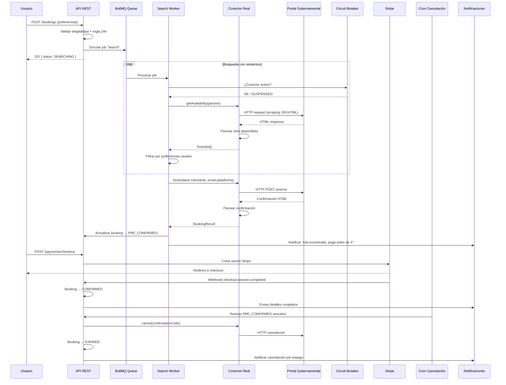
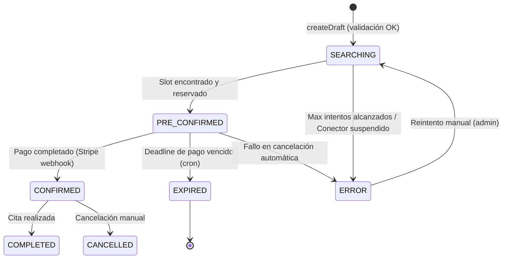

# Diseño — Flujo Real de Reserva con Conectores

## Visión General

Este diseño describe la evolución del sistema de reservas desde el conector mock actual hacia conectores reales que interactúan con portales gubernamentales españoles (Extranjería, DGT, AEAT, SEPE, Registro Civil). El flujo completo es:

1. El usuario crea una solicitud de búsqueda con sus preferencias
2. Un agente en background busca disponibilidad en el portal real
3. Al encontrar un slot, el conector reserva la cita usando el email de la plataforma
4. Se notifica al usuario y se le da un plazo para pagar (24h antes de la cita)
5. Si paga, se confirma la cita y se revelan los detalles completos
6. Si no paga a tiempo, un cron job cancela la cita en el portal y libera el slot

### Decisiones de diseño clave

- **BullMQ como orquestador**: El search loop actual (`_runSearchLoop` con `setTimeout`) se reemplaza por jobs de BullMQ para resiliencia, reintentos y observabilidad. BullMQ ya es dependencia del proyecto.
- **Circuit breaker en memoria + DB**: Estado `SUSPENDED` en la tabla `Connector` + contadores en Redis para detección rápida de fallos.
- **Email interception vía webhook de SendGrid/Mailgun Inbound Parse**: No se implementa un servidor SMTP propio; se usa el servicio de email existente (SendGrid) con Inbound Parse para recibir emails de los portales.
- **Rate limiting por conector**: Implementado con un token bucket en Redis, configurable por conector (`rateLimit` requests/minuto).
- **Conectores como clases que extienden `BaseRealConnector`**: Clase base que encapsula HTTP client, rate limiting, circuit breaker y logging. Cada conector real solo implementa la lógica de parsing específica del portal.

## Arquitectura

### Diagrama de flujo principal



### Diagrama de estados del booking



## Componentes e Interfaces

### 1. `BaseRealConnector` (clase abstracta)

Clase base para todos los conectores reales. Encapsula la lógica común.

```typescript
// src/modules/connectors/adapters/base-real.connector.ts

export abstract class BaseRealConnector implements IConnector {
  abstract readonly metadata: ConnectorMetadata;

  protected httpClient: AxiosInstance;
  protected rateLimiter: RateLimiter;

  constructor(protected config: RealConnectorConfig) {
    this.httpClient = axios.create({
      baseURL: config.baseUrl,
      timeout: config.timeoutMs ?? 30_000,
      headers: { 'User-Agent': 'GestorCitas/1.0' },
    });
    this.rateLimiter = new RateLimiter(config.connectorSlug, config.rateLimit);
  }

  async healthCheck(): Promise<boolean> {
    await this.rateLimiter.acquire();
    try {
      const res = await this.httpClient.get(this.getHealthEndpoint());
      return res.status === 200;
    } catch {
      return false;
    }
  }

  async getAvailability(procedureId: string, fromDate: string, toDate: string): Promise<TimeSlot[]> {
    await this.rateLimiter.acquire();
    const html = await this.fetchAvailabilityPage(procedureId, fromDate, toDate);
    this.detectAnomalies(html); // lanza CircuitBreakerError si detecta CAPTCHA/cambios
    return this.parseAvailability(html);
  }

  async book(bookingData: Record<string, unknown>): Promise<BookingResult> {
    await this.rateLimiter.acquire();
    const html = await this.submitBookingForm(bookingData);
    this.detectAnomalies(html);
    return this.parseBookingResult(html);
  }

  async cancel(confirmationCode: string): Promise<boolean> {
    await this.rateLimiter.acquire();
    return this.submitCancellation(confirmationCode);
  }

  // Métodos abstractos que cada conector implementa
  protected abstract getHealthEndpoint(): string;
  protected abstract fetchAvailabilityPage(procedureId: string, from: string, to: string): Promise<string>;
  protected abstract parseAvailability(html: string): TimeSlot[];
  protected abstract submitBookingForm(data: Record<string, unknown>): Promise<string>;
  protected abstract parseBookingResult(html: string): BookingResult;
  protected abstract submitCancellation(code: string): Promise<boolean>;

  // Detección de anomalías (CAPTCHA, cambios de estructura)
  protected detectAnomalies(html: string): void {
    if (this.hasCaptcha(html)) {
      throw new CircuitBreakerError('CAPTCHA detectado', 'CAPTCHA_DETECTED');
    }
    if (!this.hasExpectedStructure(html)) {
      throw new CircuitBreakerError('Estructura del portal cambió', 'STRUCTURE_CHANGED');
    }
  }

  protected abstract hasCaptcha(html: string): boolean;
  protected abstract hasExpectedStructure(html: string): boolean;
}
```

### 2. `CircuitBreakerService`

Gestiona el estado de salud de los conectores. Usa Redis para contadores rápidos y Prisma para persistencia.

```typescript
// src/modules/connectors/circuit-breaker.service.ts

export interface CircuitBreakerConfig {
  failureThreshold: number;    // fallos consecutivos para suspender (default: 3)
  resetTimeoutMs: number;      // tiempo antes de permitir un health check (default: 300_000)
  windowMs: number;            // ventana de tiempo para contar fallos (default: 60_000)
}

export const circuitBreakerService = {
  async recordFailure(connectorId: string, reason: string): Promise<void>;
  async recordSuccess(connectorId: string): Promise<void>;
  async isOpen(connectorId: string): Promise<boolean>;
  async suspend(connectorId: string, reason: string): Promise<void>;
  async reactivate(connectorId: string, adminUserId: string): Promise<void>;
  async getStatus(connectorId: string): Promise<CircuitBreakerStatus>;
};
```

### 3. `SearchWorker` (BullMQ)

Reemplaza `_runSearchLoop`. Cada job representa un intento de búsqueda.

```typescript
// src/modules/bookings/search.worker.ts

export const SEARCH_QUEUE_NAME = 'booking-search';

// Job data
interface SearchJobData {
  bookingRequestId: string;
  attemptNumber: number;
}

// El worker:
// 1. Verifica que el booking siga en SEARCHING
// 2. Verifica que el conector no esté SUSPENDED
// 3. Llama a getAvailability + filtra por preferencias
// 4. Si encuentra slot → llama a book() → PRE_CONFIRMED
// 5. Si no encuentra → re-encola con delay (respetando rate limit)
// 6. Si falla con CircuitBreakerError → suspende conector
// 7. Si alcanza MAX_ATTEMPTS → ERROR
```

### 4. `EmailInterceptionService`

Procesa emails entrantes de los portales gubernamentales.

```typescript
// src/modules/email-interception/email-interception.service.ts

export interface ParsedConfirmationEmail {
  confirmationCode: string;
  appointmentDate: string;
  appointmentTime: string;
  location?: string;
  rawBody: string;
  portalOrigin: string;
}

export const emailInterceptionService = {
  async processInboundEmail(payload: InboundEmailPayload): Promise<void>;
  async parseConfirmation(body: string, from: string): Promise<ParsedConfirmationEmail>;
  async correlateToBooking(parsed: ParsedConfirmationEmail): Promise<string | null>;
  formatConfirmation(parsed: ParsedConfirmationEmail): string;
};
```

### 5. `AutoCancellationCronJob`

Cron job que revisa bookings `PRE_CONFIRMED` con deadline vencido.

```typescript
// src/modules/bookings/auto-cancellation.cron.ts

// Ejecuta cada 5 minutos via BullMQ repeatable job
// 1. Busca BookingRequest WHERE status = PRE_CONFIRMED AND paymentDeadline < NOW()
// 2. Para cada uno:
//    a. Obtiene el conector asociado
//    b. Llama a connector.cancel(confirmationCode)
//    c. Si éxito → status = EXPIRED, notifica usuario
//    d. Si fallo → status = ERROR, alerta operaciones
```

### 6. `RateLimiter`

Token bucket por conector usando Redis.

```typescript
// src/modules/connectors/rate-limiter.ts

export class RateLimiter {
  constructor(
    private connectorSlug: string,
    private requestsPerMinute: number
  ) {}

  async acquire(): Promise<void>;  // espera si no hay tokens
  async tryAcquire(): Promise<boolean>;  // no-blocking
}
```

### 7. Cambios en `IConnector`

La interfaz existente se mantiene compatible. Se añade el campo `email` al `book()` data:

```typescript
// Extensión del bookingData para conectores reales
interface RealBookingData {
  applicantFirstName: string;
  applicantLastName: string;
  documentType: string;
  documentNumber: string;
  nationality: string;
  birthDate: string;
  email: string;           // Email de la plataforma (no del usuario)
  phone?: string;
  selectedDate: string;
  selectedTime: string;
  procedureSlug: string;
  // campos adicionales según el portal
  [key: string]: unknown;
}
```

### 8. Cambios en `BookingService`

- `createDraft`: Añadir validación de regla 24h (`preferredDateFrom >= now + 24h`). Encolar job en BullMQ en vez de llamar a `_runSearchLoop`.
- `_runSearchLoop`: Se depreca. La lógica se mueve al `SearchWorker`.
- `confirmAfterPayment`: Sin cambios significativos (ya funciona correctamente).
- Nuevo: `expireBooking(bookingId)`: Llamado por el cron de auto-cancelación.

### 9. Cambios en `ConnectorRegistry`

- Registrar conectores reales al bootstrap.
- Método `getByOrganizationSlug(slug)` ya existe (lookup por slug).
- Ejecutar `healthCheck()` al registrar cada conector.

## Modelos de Datos

### Cambios en el schema de Prisma

No se requieren nuevas tablas. Los campos necesarios ya existen:

| Campo | Tabla | Estado |
|-------|-------|--------|
| `paymentDeadline` | `BookingRequest` | ✅ Ya existe |
| `preferredDateFrom/To` | `BookingRequest` | ✅ Ya existe |
| `preferredTimeSlot` | `BookingRequest` | ✅ Ya existe |
| `externalRef` | `BookingRequest` | ✅ Ya existe |
| `status: SUSPENDED` | `Connector` (enum `ConnectorStatus`) | ✅ Ya existe |
| `status: EXPIRED` | `BookingRequest` (enum `BookingStatus`) | ✅ Ya existe |
| `rateLimit` | `Connector` | ✅ Ya existe |
| `confirmationCode` | `Appointment` | ✅ Ya existe |
| `serviceFee` | `Procedure` | ✅ Ya existe |

#### Campos nuevos necesarios

```prisma
model BookingRequest {
  // ... campos existentes ...
  maxSearchAttempts  Int?       // máximo de intentos de búsqueda (default: 20)
  searchJobId        String?    // ID del job de BullMQ para tracking
}

model Connector {
  // ... campos existentes ...
  lastHealthCheck    DateTime?  // último healthCheck exitoso (renombrar lastComplianceCheck o añadir)
  errorRate          Float?     @default(0)  // tasa de errores reciente
  avgResponseTimeMs  Int?       // tiempo medio de respuesta
  suspendedReason    String?    // motivo de suspensión (CAPTCHA, STRUCTURE_CHANGED, etc.)
  suspendedAt        DateTime?  // cuándo se suspendió
}

model BookingAttempt {
  // ... campos existentes ...
  responseTimeMs     Int?       // tiempo de respuesta del portal
  httpStatusCode     Int?       // código HTTP de la respuesta
}
```

#### Nueva tabla para emails interceptados

```prisma
model InterceptedEmail {
  id               String   @id @default(uuid())
  bookingRequestId String?
  fromAddress      String
  subject          String
  rawBody          String   @db.Text
  parsedData       Json?
  portalOrigin     String
  correlationStatus String  @default("PENDING") // PENDING, MATCHED, UNMATCHED
  processedAt      DateTime?
  createdAt        DateTime @default(now())

  bookingRequest   BookingRequest? @relation(fields: [bookingRequestId], references: [id])

  @@map("intercepted_emails")
}
```

### Estructura de archivos nuevos

```
src/modules/
├── connectors/
│   ├── adapters/
│   │   ├── base-real.connector.ts       # Clase base para conectores reales
│   │   ├── extranjeria.connector.ts     # Conector Extranjería (prioridad alta)
│   │   ├── dgt.connector.ts             # Conector DGT
│   │   ├── aeat.connector.ts            # Conector AEAT
│   │   ├── sepe.connector.ts            # Conector SEPE
│   │   ├── registro-civil.connector.ts  # Conector Registro Civil
│   │   └── mock.connector.ts            # (existente)
│   ├── circuit-breaker.service.ts
│   ├── rate-limiter.ts
│   ├── connector.interface.ts           # (existente, sin cambios)
│   └── connector.registry.ts            # (existente, ampliar)
├── bookings/
│   ├── search.worker.ts                 # Worker BullMQ
│   ├── search.queue.ts                  # Configuración de la cola
│   ├── auto-cancellation.cron.ts        # Cron job cancelación
│   ├── booking.service.ts               # (existente, modificar)
│   └── booking.routes.ts                # (existente, sin cambios significativos)
├── email-interception/
│   ├── email-interception.service.ts
│   ├── email-interception.routes.ts     # Endpoint para webhook inbound
│   └── parsers/                         # Parsers por portal
│       ├── extranjeria.parser.ts
│       ├── dgt.parser.ts
│       └── generic.parser.ts
└── payments/
    └── payment.service.ts               # (existente, sin cambios)
```


## Propiedades de Corrección

*Una propiedad es una característica o comportamiento que debe cumplirse en todas las ejecuciones válidas de un sistema — esencialmente, una declaración formal sobre lo que el sistema debe hacer. Las propiedades sirven como puente entre especificaciones legibles por humanos y garantías de corrección verificables por máquinas.*

### Propiedad 1: Validación de regla de 24 horas

*Para toda* fecha `preferredDateFrom` que esté a menos de 24 horas del momento actual, la creación de un draft debe ser rechazada con código de error `DATE_TOO_SOON`, y ninguna Reserva debe ser creada.

**Valida: Requisitos 1.2**

### Propiedad 2: Validación de elegibilidad del solicitante

*Para todo* par (perfil de solicitante, procedimiento con reglas de elegibilidad), si el perfil no cumple alguna regla (edad mínima, tipo de documento, nacionalidad), la creación del draft debe ser rechazada con código `ELIGIBILITY_FAILED` y la lista de errores debe contener al menos un mensaje descriptivo.

**Valida: Requisitos 1.4**

### Propiedad 3: Filtrado de slots por preferencias del usuario

*Para todo* conjunto de slots devueltos por un portal y cualquier combinación de preferencias (rango de fechas, franja horaria mañana/tarde), los slots filtrados deben contener únicamente slots cuya fecha esté dentro del rango y cuya hora corresponda a la franja seleccionada (mañana: hora < 14, tarde: hora >= 14).

**Valida: Requisitos 2.2**

### Propiedad 4: Registro de intentos de interacción con portales

*Para toda* interacción con un portal gubernamental (búsqueda, reserva o cancelación), debe existir un registro `BookingAttempt` asociado que incluya el `connectorId`, `attemptNumber`, resultado (`success`), `responseTimeMs` y `httpStatusCode`.

**Valida: Requisitos 2.5, 10.2, 10.3**

### Propiedad 5: El método book usa el email de la plataforma

*Para toda* invocación del método `book()` de un conector real, los datos enviados al portal deben contener el `Email_Plataforma` (no el email del usuario) como dirección de contacto, y el resultado debe ser un `BookingResult` con los campos `confirmationCode`, `appointmentDate`, `appointmentTime` y `location`.

**Valida: Requisitos 3.1, 6.3**

### Propiedad 6: Reserva exitosa produce PRE_CONFIRMED con deadline correcto

*Para toda* reserva exitosa en un portal, la Reserva debe transicionar a estado `PRE_CONFIRMED` con `selectedDate`, `selectedTime`, `externalRef` (código de confirmación) poblados, y el `paymentDeadline` debe ser exactamente 24 horas antes de la `selectedDate`.

**Valida: Requisitos 3.2, 3.3**

### Propiedad 7: PRE_CONFIRMED oculta detalles hasta el pago

*Para toda* Reserva en estado `PRE_CONFIRMED`, la respuesta de la API al usuario no debe incluir el `confirmationCode` ni la `location` exacta del `Appointment` asociado. Estos campos solo deben ser visibles cuando el estado es `CONFIRMED`.

**Valida: Requisitos 3.5**

### Propiedad 8: Solo PRE_CONFIRMED permite crear checkout

*Para toda* Reserva cuyo estado no sea `PRE_CONFIRMED`, intentar crear una sesión de checkout de Stripe debe resultar en un error con código `NOT_PRE_CONFIRMED`. Solo las Reservas en `PRE_CONFIRMED` deben permitir la creación de sesiones de pago.

**Valida: Requisitos 4.1**

### Propiedad 9: Pago exitoso transiciona a CONFIRMED

*Para toda* Reserva en estado `PRE_CONFIRMED` con un pago completado exitosamente, la Reserva debe transicionar a estado `CONFIRMED` y el campo `completedAt` debe estar poblado.

**Valida: Requisitos 4.2**

### Propiedad 10: Unicidad de número de factura

*Para todo* par de pagos completados, los números de factura (`invoiceNumber`) generados deben ser distintos entre sí.

**Valida: Requisitos 4.4**

### Propiedad 11: Tarifa de servicio dentro del rango válido

*Para todo* procedimiento con `serviceFee` configurado, el valor debe estar entre 9,99€ y 29,99€ inclusive.

**Valida: Requisitos 4.6**

### Propiedad 12: Deadline vencido produce cancelación y estado EXPIRED

*Para toda* Reserva en estado `PRE_CONFIRMED` cuyo `paymentDeadline` haya pasado sin pago completado, el proceso de auto-cancelación debe intentar cancelar la cita en el portal y, si la cancelación es exitosa, actualizar el estado a `EXPIRED`.

**Valida: Requisitos 5.1, 5.2**

### Propiedad 13: Notificaciones en transiciones de estado

*Para toda* transición de estado de una Reserva a `PRE_CONFIRMED`, `CONFIRMED` o `EXPIRED`, el sistema debe crear una notificación para el usuario asociado. La notificación para `CONFIRMED` debe incluir fecha, hora, ubicación y código de confirmación.

**Valida: Requisitos 3.4, 4.3, 5.3**

### Propiedad 14: Completitud de metadata de conectores

*Para todo* conector registrado en el `ConnectorRegistry`, su `metadata` debe contener valores no vacíos para `organizationSlug`, `integrationType`, `complianceLevel`, y los booleanos `canCheckAvailability`, `canBook` y `canCancel` deben estar definidos.

**Valida: Requisitos 6.2**

### Propiedad 15: Enforcement del rate limiter

*Para toda* secuencia de N requests al rate limiter con un límite de M requests/minuto donde N > M, el rate limiter debe bloquear o retrasar las requests que excedan M dentro de la ventana de un minuto.

**Valida: Requisitos 6.5**

### Propiedad 16: Round-trip del registro de conectores

*Para todo* conector registrado con un `id` y un `organizationSlug`, buscar por `id` y buscar por `organizationSlug` debe devolver el mismo conector.

**Valida: Requisitos 6.6**

### Propiedad 17: Circuit breaker se activa ante anomalías

*Para toda* respuesta HTML que contenga marcadores de CAPTCHA o que no coincida con la estructura esperada del portal, el circuit breaker debe suspender el conector cambiando su estado a `SUSPENDED` con el motivo correspondiente (`CAPTCHA_DETECTED` o `STRUCTURE_CHANGED`).

**Valida: Requisitos 7.1, 7.2**

### Propiedad 18: Efectos secundarios de la suspensión del circuit breaker

*Para toda* suspensión de un conector por el circuit breaker, debe existir un registro en `AuditLog` con acción `CONNECTOR_TOGGLE` y debe enviarse una notificación a los usuarios con rol `OPERATOR` o `ADMIN`.

**Valida: Requisitos 7.3, 7.4**

### Propiedad 19: Conector suspendido rechaza nuevas búsquedas

*Para todo* trámite asociado a un conector en estado `SUSPENDED`, intentar crear una nueva solicitud de búsqueda debe ser rechazado con un mensaje indicando que el servicio está temporalmente no disponible.

**Valida: Requisitos 7.5**

### Propiedad 20: Suspensión cascada SEARCHING → ERROR

*Para toda* Reserva en estado `SEARCHING` asociada a un conector que pasa a estado `SUSPENDED`, la Reserva debe transicionar a estado `ERROR` y el usuario debe recibir una notificación.

**Valida: Requisitos 7.6**

### Propiedad 21: HealthCheck al registrar conector

*Para todo* conector que se registra en el `ConnectorRegistry`, el método `healthCheck()` debe ser invocado durante el proceso de registro.

**Valida: Requisitos 8.6**

### Propiedad 22: Parsing de emails de confirmación

*Para todo* email de confirmación válido de un portal gubernamental, el parser debe extraer correctamente `confirmationCode`, `appointmentDate`, `appointmentTime` y `location` según el formato específico del portal de origen.

**Valida: Requisitos 9.1, 9.4**

### Propiedad 23: Correlación de email a reserva

*Para todo* email de confirmación parseado con un `confirmationCode` válido, el sistema debe asociarlo a la Reserva cuyo `externalRef` o `Appointment.confirmationCode` coincida.

**Valida: Requisitos 9.2**

### Propiedad 24: Round-trip de parsing/formateo de emails

*Para todo* email de confirmación válido, parsear el email, formatear el resultado, y volver a parsear debe producir datos equivalentes al primer parseo.

**Valida: Requisitos 9.5**

### Propiedad 25: Round-trip de cifrado de formData

*Para todo* objeto JSON de formData, cifrar con `encrypt()` y luego descifrar con `decrypt()` debe producir un objeto equivalente al original.

**Valida: Requisitos 11.1**

### Propiedad 26: Conectores usan HTTPS

*Para todo* conector real registrado, su `baseUrl` debe comenzar con `https://`.

**Valida: Requisitos 11.2**

### Propiedad 27: Purga de datos sensibles tras 30 días

*Para toda* Reserva en estado `CONFIRMED` o `EXPIRED` cuya fecha de cita sea anterior a 30 días, el campo `formData` debe estar vacío o contener un marcador de datos purgados.

**Valida: Requisitos 11.3**

### Propiedad 28: Auditoría de acceso a datos personales

*Para todo* acceso de lectura a datos personales del solicitante (`formData`, `ApplicantProfile`), debe existir un registro en `AuditLog` con acción `READ`.

**Valida: Requisitos 11.4**

### Propiedad 29: Búsqueda solo para bookings en SEARCHING

*Para toda* Reserva cuyo estado no sea `SEARCHING`, el search worker no debe ejecutar ninguna búsqueda en el portal gubernamental.

**Valida: Requisitos 2.1**

### Propiedad 30: Auditoría de transiciones de estado

*Para toda* transición de estado de una Reserva, debe existir un registro en `AuditLog` con la acción correspondiente, el `entityType` = `BookingRequest`, el `entityId` del booking, y los datos antes/después del cambio.

**Valida: Requisitos 10.1**

## Manejo de Errores

### Errores de conectores

| Escenario | Acción | Estado resultante |
|-----------|--------|-------------------|
| Portal no responde (timeout) | Registrar en `BookingAttempt`, reintentar | `SEARCHING` (continúa) |
| CAPTCHA detectado | Circuit breaker suspende conector | `SUSPENDED` (conector), `ERROR` (bookings activos) |
| Estructura HTML cambió | Circuit breaker suspende conector | `SUSPENDED` (conector), `ERROR` (bookings activos) |
| Rate limit del portal (HTTP 429) | Esperar y reintentar con backoff exponencial | `SEARCHING` (continúa) |
| Reserva falla en portal | Registrar error, continuar búsqueda | `SEARCHING` (continúa si quedan intentos) |
| Cancelación falla en portal | Registrar error, alertar operaciones | `ERROR` |
| Max intentos alcanzados | Notificar usuario | `ERROR` |

### Errores de pago

| Escenario | Acción | Estado resultante |
|-----------|--------|-------------------|
| Webhook Stripe no llega | Fallback: verificar vía API directa | Se resuelve en `confirmBySession` |
| Pago rechazado | Permitir reintento | `PRE_CONFIRMED` (sin cambio) |
| Sesión Stripe expirada | Permitir crear nueva sesión | `PRE_CONFIRMED` (sin cambio) |

### Errores de email interception

| Escenario | Acción | Estado resultante |
|-----------|--------|-------------------|
| Email no correlaciona con booking | Registrar anomalía en audit log | Sin cambio de estado |
| Parser falla | Registrar error, guardar email raw | Sin cambio de estado |
| Email duplicado | Idempotente, ignorar | Sin cambio de estado |

### Códigos de error de la API

| Código | HTTP | Descripción |
|--------|------|-------------|
| `DATE_TOO_SOON` | 422 | `preferredDateFrom` a menos de 24h |
| `ELIGIBILITY_FAILED` | 422 | Solicitante no cumple requisitos |
| `CONNECTOR_SUSPENDED` | 503 | Conector temporalmente no disponible |
| `NOT_PRE_CONFIRMED` | 409 | Booking no está en estado para pagar |
| `ALREADY_PAID` | 409 | Booking ya fue pagado |
| `PAYMENT_DEADLINE_EXPIRED` | 410 | Plazo de pago vencido |
| `CONNECTOR_UNAVAILABLE` | 500 | Conector no encontrado en registry |

## Estrategia de Testing

### Enfoque dual: tests unitarios + tests basados en propiedades

Se utilizan dos tipos de tests complementarios:

- **Tests unitarios (Jest)**: Para ejemplos específicos, edge cases, integraciones entre componentes y escenarios de error concretos. No se deben escribir demasiados tests unitarios — los tests de propiedades cubren la variedad de inputs.
- **Tests basados en propiedades (fast-check)**: Para verificar propiedades universales que deben cumplirse para todos los inputs válidos. Cada propiedad del documento de diseño se implementa como un test de propiedad.

### Librería de property-based testing

Se usará **fast-check** (`npm install --save-dev fast-check`), la librería estándar de PBT para TypeScript/JavaScript.

### Configuración de tests de propiedades

- Cada test de propiedad debe ejecutar un mínimo de **100 iteraciones**.
- Cada test debe incluir un comentario referenciando la propiedad del diseño:
  ```typescript
  // Feature: real-connector-booking-flow, Property 1: Validación de regla de 24 horas
  ```
- Formato del tag: **Feature: real-connector-booking-flow, Property {número}: {título}**
- Cada propiedad de corrección se implementa con **un único test de propiedad**.

### Distribución de tests

| Componente | Tests unitarios | Tests de propiedades |
|------------|----------------|---------------------|
| `BookingService.createDraft` | Perfil no encontrado, trámite no encontrado | P1 (24h), P2 (elegibilidad) |
| `SearchWorker` | Max intentos → ERROR, conector no disponible | P3 (filtrado slots), P4 (logging attempts), P29 (solo SEARCHING) |
| `BaseRealConnector.book` | Timeout, error HTTP | P5 (email plataforma) |
| `BookingService._confirmSlot` | Appointment duplicado | P6 (PRE_CONFIRMED + deadline) |
| `BookingService.getBookingById` | — | P7 (ocultar detalles PRE_CONFIRMED) |
| `PaymentService.createCheckoutSession` | Booking no encontrado | P8 (solo PRE_CONFIRMED) |
| `PaymentService.handleWebhook` | Webhook inválido | P9 (pago → CONFIRMED), P10 (factura única) |
| `Procedure.serviceFee` | — | P11 (rango tarifa) |
| `AutoCancellationCron` | Cancelación falla → ERROR | P12 (deadline → EXPIRED) |
| `NotificationService` | — | P13 (notificaciones en transiciones) |
| `ConnectorRegistry` | — | P14 (metadata), P16 (round-trip) |
| `RateLimiter` | — | P15 (enforcement) |
| `CircuitBreakerService` | — | P17 (anomalías), P18 (side effects), P19 (rechaza búsquedas), P20 (cascada) |
| `ConnectorRegistry.register` | — | P21 (healthCheck) |
| `EmailInterceptionService` | Email no correlaciona → anomalía | P22 (parsing), P23 (correlación), P24 (round-trip) |
| `crypto` | — | P25 (encrypt/decrypt round-trip) |
| Conectores reales | — | P26 (HTTPS) |
| Data retention cron | — | P27 (purga 30 días) |
| `AuditService` | — | P28 (acceso datos), P30 (transiciones) |

### Tests unitarios prioritarios (ejemplos y edge cases)

1. **Max intentos sin disponibilidad** → booking pasa a ERROR (Req 2.4)
2. **Reserva falla en portal** → registra error, continúa búsqueda (Req 3.6)
3. **Webhook Stripe no llega** → fallback por API directa (Req 4.5)
4. **Cancelación en portal falla** → ERROR + alerta operaciones (Req 5.5)
5. **Reactivación de conector suspendido** → solo ADMIN/COMPLIANCE_OFFICER (Req 7.7)
6. **Conectores registrados al bootstrap** → Extranjería, DGT, AEAT, SEPE, Registro Civil (Req 8.1, 8.5)
7. **Email no correlaciona** → anomalía en audit log (Req 9.3)
8. **Métricas de salud de conectores** → accesible solo para ADMIN (Req 10.4)
